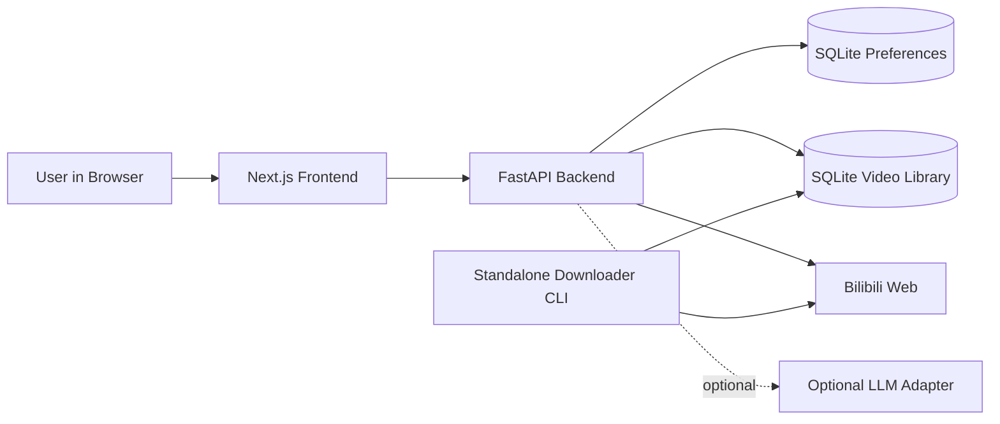
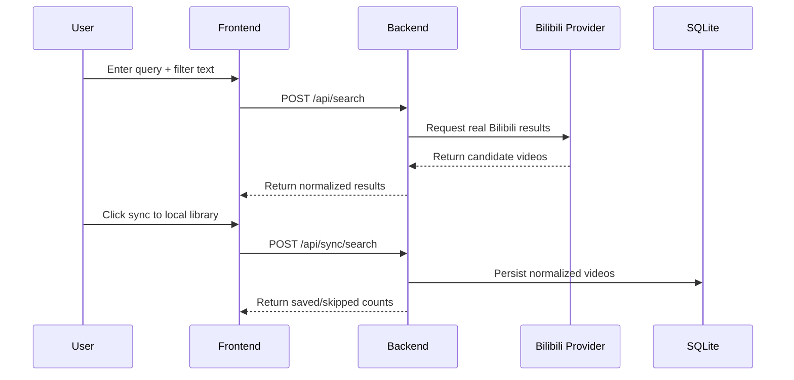
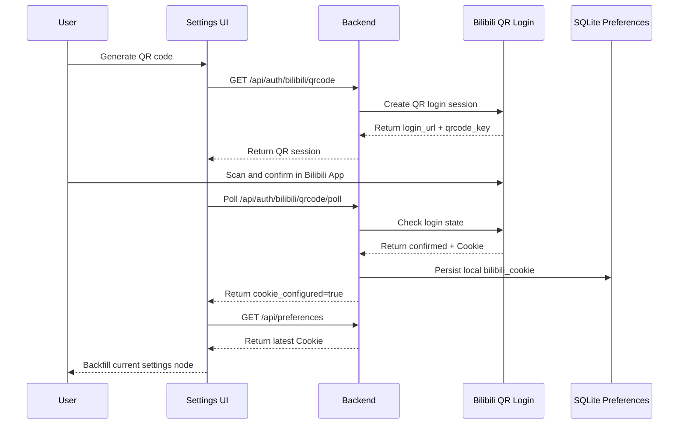
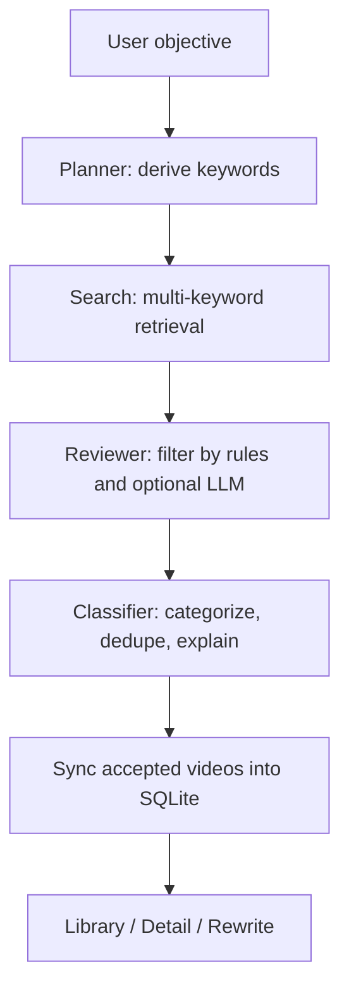

# BiliFocus

[中文 README](./README.md)

BiliFocus is a local-first, single-user workspace for exploring and organizing Bilibili videos.

It is not trying to replace the Bilibili website. The goal is narrower and more useful: turn scattered search results into a local, searchable, revisitable library that you can actually keep working with.

This project is a good fit if you want to:

- search around a topic repeatedly without losing context
- turn "I will sort this later" into a repeatable local workflow
- keep real Bilibili discovery while building your own local video library
- manage Bilibili cookie state and QR login locally, without introducing an app-level account system

## What It Can Do Today

- Real Bilibili Web search
- Lightweight natural-language filtering such as "tutorials only" or "exclude livestream clips"
- Sync normalized search results into local SQLite
- Browse a local library with keyword filters, category navigation, sorting, and pagination
- Rewrite local metadata with structured summaries, tags, and learning focus
- Manage local preferences, Bilibili Cookie, and QR-code login from Settings
- Open a cleaner local video detail page with playback metadata and stream information
- Run an automated curation flow around a learning objective
- Use a separate local CLI downloader for explicit `bvid` downloads

## Product Framing

BiliFocus matters because it connects the full loop:

search -> filter -> sync -> organize -> revisit.

Instead of behaving like another entertainment surface, it behaves more like a quiet research desk. You search from the live web, but what stays with you is a local collection you can continue shaping.

## Stack

- Backend: FastAPI, SQLAlchemy, SQLite, Pydantic
- Frontend: Next.js, TypeScript, Tailwind CSS
- Runtime: Docker, Docker Compose
- Storage: local SQLite in `./data/`
- Optional intelligence layer: OpenAI / Volcengine compatible LLM adapter, optional CrewAI orchestration

## Architecture



## Core Flows

### 1. Search to Local Library



### 2. QR Login and Cookie Backfill



### 3. Automated Curation



## Pages and Scope

- `Explore`: search, filtering, sync into the local library
- `Library`: local library browsing, categories, sorting, pagination
- `Settings`: preferences, Bilibili Cookie, QR login, structured rewrite action
- `Video Detail`: local detail view, cleaner playback shell, stream and metadata panels

What this project deliberately does not do:

- multi-user accounts
- a standalone app login page
- permissions and auth layers for local users
- comments, danmaku, messaging
- cloud deployment as a requirement
- cloud vector databases
- LLM-only core workflows

## Quick Start

### Option A: Docker Compose

```bash
docker-compose up --build
```

Then open:

- Frontend: `http://localhost:3000`
- Backend: `http://localhost:8000`
- Health: `http://localhost:8000/health`

### Option B: Local Dev Script

```bash
./run.sh setup
./run.sh backend
./run.sh frontend
```

To run both services in the background:

```bash
./run.sh dev
./run.sh status
./run.sh stop
```

## Environment Setup

The project reads:

- `apps/backend/.env`
- `apps/frontend/.env.local`

Typical backend config:

```env
DATABASE_URL=sqlite:///./data/bilifocus.db
CORS_ALLOW_ORIGINS=http://localhost:3000,http://127.0.0.1:3000,http://frontend:3000

LLM_REFINEMENT_ENABLED=false
LLM_PROVIDER=openai
OPENAI_API_KEY=
OPENAI_MODEL=gpt-5-mini
OPENAI_REASONING_EFFORT=low

CREWAI_ENABLED=false
```

Typical frontend config:

```env
API_BASE_URL=http://127.0.0.1:8000
NEXT_PUBLIC_API_BASE_URL=http://127.0.0.1:8000
```

Notes:

- You do not need any LLM configuration for the core product loop
- If you configure an LLM, it can enhance curation, classification, and refinement
- Bilibili Cookie can be pasted manually or filled via QR login inside Settings

## Project Layout

```text
apps/
  backend/      FastAPI backend, providers, services, repositories
  frontend/     Next.js frontend, route pages, UI components
  downloader/   local-only downloader CLI
docs/           frozen contracts, scope and workflow docs
infra/checks/   smoke checks, UI checks, human validation helpers
data/           local SQLite database and downloaded assets
```

## Local Data and Runtime Notes

- SQLite database lives at `./data/bilifocus.db` by default
- Downloaded files are written to `./data/downloads/`
- Covers are proxied through local `/api/cover` to reduce browser-side 403 hotlink issues
- Settings are single-user local preferences, not an account system
- After QR login succeeds, the Bilibili Cookie is persisted locally and backfilled into the Settings form
