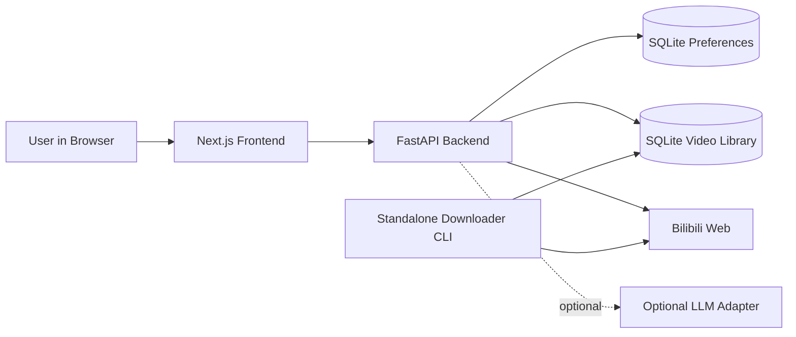
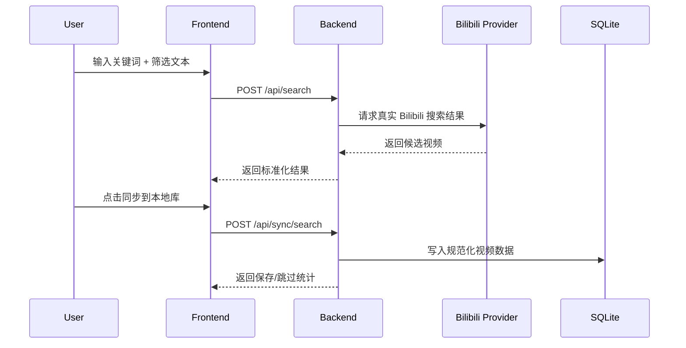
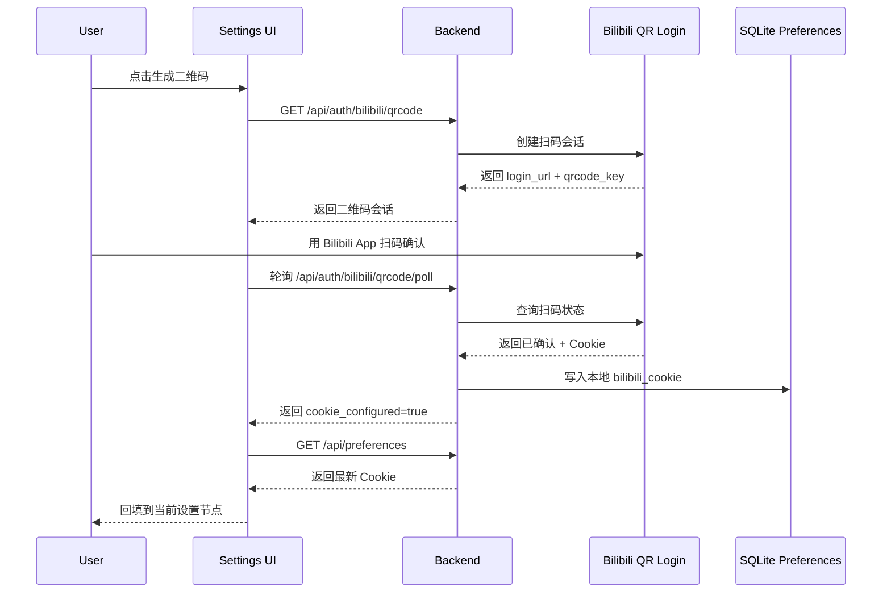
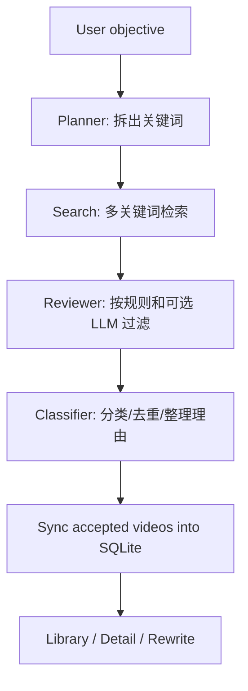

# BiliFocus

[English README](./README.en.md)

BiliFocus 是一个面向单用户的、本地优先的 Bilibili 内容工作台。

它不是另一个“视频站外壳”，而是一个更安静、更克制的工具: 帮你把 B 站里分散的视频线索，整理成一个可以搜索、筛选、同步、沉淀和回看的本地知识库。

如果你经常遇到这些情况，这个项目就是为你准备的:

- 想围绕一个主题持续找视频，但不想反复在站内搜索里来回翻
- 想把“先收藏、后整理”变成一条可复用的工作流
- 想保留 B 站内容的实时搜索能力，又希望本地有自己的片库和结构化元数据
- 想在本地完成 Cookie 管理、二维码扫码登录、高清播放探测，而不是做一个独立账号系统

## 当前能做什么

- 真实 Bilibili Web 搜索
- 轻量自然语言筛选，例如“只看教程，排除直播切片”
- 将搜索结果同步到本地 SQLite 片库
- 在 `Library` 页面按关键词、分类、排序浏览本地视频
- 对本地元数据做结构化重写，补充摘要、标签和学习焦点
- 在 `Settings` 页面维护本地偏好、Bilibili Cookie 和二维码扫码登录
- 打开本地视频详情页，使用更干净的播放界面查看流信息和基础元数据
- 运行一次自动化 curation 流程，让系统围绕学习目标规划关键词、筛选结果并回写本地库
- 使用独立的本地 CLI 下载器按 `bvid` 拉取视频文件

## 为什么它值得被包装成一个产品

BiliFocus 的重点不是“把 Bilibili 搬进来”，而是把“搜索结果”变成“可继续工作的材料”。

从真实搜索开始，到本地同步、结构化整理、分类沉淀，再到后续回看和二次检索，这条链路是连起来的。你打开它时，面对的不是娱乐平台，而是一个更像研究桌面、学习工具和内容工作台的界面。

## 技术栈

- Backend: FastAPI, SQLAlchemy, SQLite, Pydantic
- Frontend: Next.js, TypeScript, Tailwind CSS
- Runtime: Docker, Docker Compose
- Storage: local SQLite under `./data/`
- Optional intelligence layer: OpenAI / Volcengine compatible LLM adapter, optional CrewAI orchestration

## 系统架构



## 关键流程

### 1. 搜索到本地片库



### 2. 二维码登录与 Cookie 回填



### 3. 自动化内容整理



## 页面与能力边界

- `Explore`: 搜索、自然语言筛选、同步到本地库
- `Library`: 本地片库、分类浏览、分页、排序
- `Settings`: 偏好设置、Bilibili Cookie、二维码扫码登录、结构化重写入口
- `Video Detail`: 本地详情、播放壳、流信息与元数据展示

项目明确不做这些事情:

- 多用户账号体系
- 独立登录页和权限系统
- 评论、弹幕、消息
- 云端部署和云向量库
- 依赖外部 LLM 才能使用的核心流程

## 快速启动

### 方式一: Docker Compose

```bash
docker-compose up --build
```

启动后访问:

- Frontend: `http://localhost:3000`
- Health: `http://localhost:3000/backend-api/health`
- Backend: 默认仅容器内可访问，不对外暴露端口

### 方式二: 本地开发脚本

```bash
./run.sh setup
./run.sh backend
./run.sh frontend
```

如果你希望一键在后台启动:

```bash
./run.sh dev
./run.sh status
./run.sh stop
```

## 环境配置

当前仓库默认读取:

- `apps/backend/.env`
- `apps/frontend/.env.local`

后端常用配置示例:

```env
DATABASE_URL=sqlite:///./data/bilifocus.db
CORS_ALLOW_ORIGINS=http://localhost:3000,http://127.0.0.1:3000,http://frontend:3000

LLM_REFINEMENT_ENABLED=true
LLM_PROVIDER=openai
OPENAI_API_KEY=
OPENAI_MODEL=gpt-5-mini
OPENAI_REASONING_EFFORT=low

CREWAI_ENABLED=true
```

前端常用配置示例:

```env
API_BASE_URL=http://backend:8000
NEXT_PUBLIC_API_BASE_URL=/backend-api
```

说明:

- 不配置 LLM 也可以正常完成搜索、同步、片库浏览和 Cookie 管理
- 默认会尝试启用 CrewAI 多 agent 编排；如果未配置可用的 LLM 密钥，会自动回退到本地规则或兼容 adapter
- Bilibili Cookie 可以手动粘贴，也可以在设置页中用二维码扫码回填

## 目录结构

```text
apps/
  backend/      FastAPI backend, providers, services, repositories
  frontend/     Next.js frontend, route pages and UI components
  downloader/   local-only downloader CLI
docs/           frozen contracts, scope and workflow docs
infra/checks/   smoke checks, UI checks, human validation helpers
data/           local SQLite database and downloaded assets
```

## 本地数据与运行行为

- SQLite 数据库默认位于 `./data/bilifocus.db`
- 下载文件默认写入 `./data/downloads/`
- 封面通过前端本地代理 `/api/cover` 拉取，降低浏览器直连图床时的 403 风险
- 浏览器访问后端接口时，默认经由前端 `/backend-api` 代理转发
- 设置页保存的是单用户本地偏好，不会衍生新的站内账号系统
- 二维码登录成功后，Cookie 会写入本地偏好并回填当前设置节点

## NAS 部署

推荐把 BiliFocus 作为两个容器部署在 NAS 上：

- `frontend`：唯一对外暴露的服务
- `backend`：只在 Docker 网络内部可访问

这样浏览器所有 API 请求都会先进入前端，再由前端代理到后端，更适合 NAS 场景下的单入口部署。

### 目录准备

建议在 NAS 上准备一个固定目录，例如：

```text
/volume1/docker/bilifocus/
  apps/
  data/
  docker-compose.yml
```

你也可以把整个仓库直接放在这个目录下运行。

### 环境文件

后端 `apps/backend/.env` 建议至少配置：

```env
APP_NAME=bilifocus-backend
APP_VERSION=0.1.0
API_PREFIX=/api
DATABASE_URL=sqlite:///./data/bilifocus.db
CORS_ALLOW_ORIGINS=http://nas-ip:3000,https://app.your-domain.com
LLM_REFINEMENT_ENABLED=true
OPENAI_API_KEY=
OPENAI_MODEL=gpt-5-mini
CREWAI_ENABLED=true
```

前端 `apps/frontend/.env.local` 建议配置：

```env
API_BASE_URL=http://backend:8000
NEXT_PUBLIC_API_BASE_URL=/backend-api
```

说明：

- `API_BASE_URL` 是前端容器内部访问后端的地址
- `NEXT_PUBLIC_API_BASE_URL=/backend-api` 表示浏览器统一通过前端代理访问后端

### Compose 启动

默认 `docker-compose.yml` 已适合 NAS 常驻运行：

- 后端不再对外暴露 `8000`
- 前端默认暴露 `3000`
- 数据目录通过 `${BILIFOCUS_DATA_DIR:-./data}` 挂载
- 容器默认 `restart: unless-stopped`

如果你想把数据明确挂到 NAS 共享盘，可这样启动：

```bash
BILIFOCUS_DATA_DIR=/volume1/docker/bilifocus/data \
BILIFOCUS_FRONTEND_PORT=3000 \
docker-compose up -d --build
```

### 启动后检查

浏览器访问：

- `http://nas-ip:3000`
- `http://nas-ip:3000/backend-api/health`

如果你使用 NAS 自带反向代理或自定义域名，也可以把：

- `app.your-domain.com` -> `frontend:3000`

作为唯一对外入口。

### NAS 部署建议

- SQLite 适合当前单用户场景，但不要多实例同时写同一个数据库
- `data/` 必须放在 NAS 的持久化共享目录下
- 不要把 `.env`、数据库、Cookie 文件提交到代码仓库
- 如果启用 LLM，请只在后端 `.env` 中配置密钥
